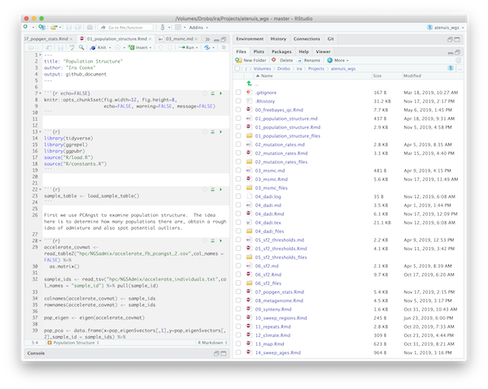

# Overview {.build}

- What is RMarkdown?
- A quick intro to RMarkdown syntax
- Using RMarkdown for reproducible research
- How I made this presentation
- Using Markdown and RMarkdown to publish to the web

# What is ~~R~~Markdown?

## What is Markdown?

The wikipedia article on Markdown describes it as;

> A lightweight markup language with plain text formatting syntax.

Its principle author, John Gruber created it for writing articles on his website, Daring Fireball in 2004


## For example

The Markdown code for the previous slide looks like this

```asis
# What is Markdown?

The wikipedia article on Markdown describes it as;

> A lightweight markup language with plain text formatting syntax.

Its principle author, John Gruber created it for 
writing articles on his website, Daring Fireball in 2004
```

## Translated to html it looks like this


```html
<h2>What is RMarkdown?</h2>
<div class="slideContent" >

<p>The wikipedia article on Markdown describes it as;</p>

<blockquote>
<p>A lightweight markup language with plain text formatting 
syntax.</p>
</blockquote>

<p>Its principle author, John Gruber created it for writing 
articles on his website, Daring Fireball in 2004</p>
```

## Components {.build}

Markdown documents are often converted to something else. Usually html.  This means there are two components to Markdown

1. The lightweight text syntax

2. A program that converts Markdown documents into html (or other formats as we will see later)

## Design and Syntax {.build}

Markdown was designed to be easy to read as-is

Since it was originally written as a text-to-html it's syntax reflects the basic html tags

For example;

```markdown
# Heading
## Subheading
### Smaller Subheading
```
```html
<h1>Heading</h1>
<h2>Subheading</h2>
<h3>Smaller Subheading</h3>
```

## More Syntax: Lists

You can make lists in Markdown like this

```markdown
- Item 1
- Item 2
```

- Item 1
- Item 2

Or this

```markdown
1. Item 1
2. Item 2
```

1. Item 1
2. Item 2

## More Syntax: Emphasis

```
Emphasise text with **bold** or _italics_
```

Emphasise text with **bold** or _italics_

```
> Or you can put some text in a blockquote
```

> Or you can put some text in a blockquote


## Github flavoured Markdown {.build}

Github uses a variant of Markdown that has become very popular among programmers.  

Perhaps the most important new feature is the "fenced code block". 

This is a fenced code block with a piece of R code

````markdown
`r ''````r
rhello <- function(){ print("Hello") }
rhello()
```
````


Which gets converted to html with syntax highlighting like this
```R
rhello <- function(){ print("Hello") }
rhello()
```

## RMarkdown {.build}

RMarkdown is an extension to Markdown that is designed to enable reproducible research.  

RMarkdown takes the idea of fenced code blocks and makes them into runnable code blocks.

````markdown
`r ''````{r}
rhello <- function(){ print("Hello") }
rhello()
```
````

```{R}
rhello <- function(){ print("Hello") }
rhello()
```


## Plots with RMarkdown {.build}

This code chunk will produce a plot

````markdown
`r ''````{r}
library(ggplot2)
ggplot(cars) + geom_smooth(aes(x=speed,y=dist))
```
````

```{r}
library(ggplot2)
ggplot(cars) + geom_smooth(aes(x=speed,y=dist))
```


## Chunk options {.build}

The way chunks are evaluated and displayed can be changed with various options


````markdown
`r ''````{r , message=FALSE, echo=FALSE, fig.height=3}
library(ggplot2)
ggplot(cars) + geom_smooth(aes(x=speed,y=dist))
```
````

```{r, message=FALSE, echo=FALSE, fig.height=3}
library(ggplot2)
ggplot(cars) + geom_smooth(aes(x=speed,y=dist))
```

## The RMarkdown engine {.build}


The engine behind RMarkdown is an R package called `knitr` and a command line program called `pandoc`  

- `knitr` does the job of running code in chunks and generating an intermediate Markdown file
- `pandoc` converts the Markdown file into other formats such as html or pdf.
- `RStudio` automates this process

## Supported Languages

RMarkdown is not just for R.  

```{r}
names(knitr::knit_engines$get())
```


## --- {.build}

For example here is a code block that runs `bash`

```{bash}
echo "Hello from bash" | cowsay
```

## --- {.build}

If you want to use `python` just install the `reticulate` package

```{python}
print("Tabs or spaces I don't care, just don't mix them anywhere")
```

RStudio even works nicely with python graphics engines like `matplotlib` if you're into that sort of thing.

# RMarkdown for reproducible research

## My workflow

My research tasks are divided evenly between running command-line tools on the HPC and analyzing outputs from those tools with R.

I document my command-line workflows with plain `Markdown` and `bash` scripts
I do all my `R` work with `RMarkdown` so it is easily converted into documentation

```{r, fig.width=7, echo=FALSE}
library(knitr)

```


## An Example

```{r, fig.width=7, echo=FALSE}
library(knitr)

```


## Github Output

I often use the output format `github_document`.  This works very well for publication because the rendered markdown files will be turned into nice web pages by Github.

````markdown
---
title: "Population Structure"
author: "Ira Cooke"
output: github_document
---
````

## Other types of output {.build}

At the top of every RMarkdown document is a short bit of `yaml`.  Here you can change the output type.

RMarkdown can be rendered into many different output types including

- Presentations (`ioslides_presentation`, `beamer_presentation`)
- Document formats (`pdf_document`, `word_document`, `latex_document`)
- Markdown derivatives (`github_document`, `md_document`)
- html (`html_document`)

In principle it is easy to switch output types but you will often need to customize to get things looking good in different formats.


## Learning Resources {.build}

**Start with:** 

- The RMarkdown section of the book `r4ds` [https://r4ds.had.co.nz/r-markdown.html](https://r4ds.had.co.nz/r-markdown.html)

**Refer to these to lookup features:**

- A book by the creators of RMarkdown [R Markdown: The Definitive Guide](https://bookdown.org/yihui/rmarkdown/)
- RStudio Cheat Sheets [https://rmarkdown.rstudio.com/lesson-15.html](https://rmarkdown.rstudio.com/lesson-15.html)

**To find out fancy things RMarkdown can do:**

- RStudio's guide to RMarkdown [https://rmarkdown.rstudio.com/](https://rmarkdown.rstudio.com/)

